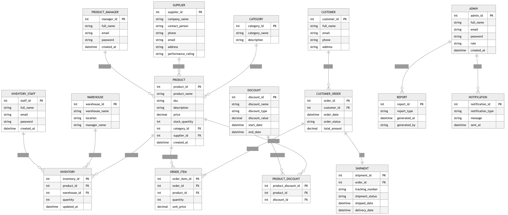

# Software Requirements Specification (SRS)

# Product Management System (PMS)

---

# Preface

This document provides the Software Requirements Specification (SRS) for the **Product Management System (PMS)**. It defines the functional and non-functional requirements, system architecture, operational constraints, and future enhancements necessary for the successful development and deployment of the system.

The Product Management System is designed to streamline product lifecycle operations including product creation, inventory tracking, supplier management, pricing, order processing, analytics, and product performance monitoring.

---

# Version History

* **Version 1.0** – Initial Draft.
* **Version 1.1** – Added system models and analytics requirements.
* **Version 1.2** – Updated security, scalability, and AI integration requirements.

---

# 1. Introduction

## Purpose

The Product Management System (PMS) is a web-based platform developed to manage products efficiently across business operations. The system automates product catalog handling, inventory monitoring, supplier coordination, order tracking, pricing management, and reporting processes.

The PMS helps organizations improve operational efficiency, reduce inventory errors, optimize product performance, and support data-driven business decisions.

---

## Document Conventions

This document follows IEEE SRS documentation standards using:

* **Must** – Mandatory requirement.
* **Should** – Recommended requirement.
* **May** – Optional or future enhancement.

---

## Intended Audience and Reading Suggestions

* **Project Managers** – For project planning and monitoring.
* **Developers** – For system implementation guidance.
* **Business Analysts** – For understanding workflows and requirements.
* **Testers & QA Teams** – For validating system behavior.
* **Stakeholders** – For reviewing business objectives and capabilities.

---

## Scope

The Product Management System includes:

* Product catalog management
* Inventory management
* Supplier and vendor management
* Pricing and discount management
* Order and shipment tracking
* Reporting and analytics
* Notification and alert system
* Role-based access control

---

## References

* IEEE Standard 830-1998 (Software Requirements Specification)
* Internal Product Requirement Document (PRD)
* Inventory and Supply Chain Documentation
* Business Workflow Specifications

---

# 2. Overall Description

## Product Perspective

The Product Management System is a centralized web application that integrates with inventory systems, supplier databases, barcode scanners, payment gateways, and shipping APIs.

The system can operate independently or integrate with ERP and e-commerce platforms.

---

## Product Functions

### Product Catalog Management

* Add, edit, categorize, and archive products.
* Manage product descriptions, specifications, and images.

### Inventory Management

* Track stock quantities in real time.
* Monitor low-stock and out-of-stock products.
* Support warehouse-level inventory management.

### Supplier Management

* Maintain supplier profiles and purchase records.
* Track supplier performance and delivery timelines.

### Pricing & Discount Management

* Configure product pricing.
* Apply seasonal discounts and promotional offers.

### Order & Shipment Tracking

* Track incoming and outgoing product orders.
* Monitor shipment status and delivery updates.

### Reporting & Analytics

* Generate sales, inventory, and supplier reports.
* Analyze product performance trends.

### Notifications & Alerts

* Send alerts for low stock, delayed shipments, and pricing updates.

---

## User Classes and Characteristics

### Admin

* Manages system configurations, users, and permissions.
* Accesses complete system reports and analytics.

### Product Manager

* Manages products, pricing, and inventory.
* Reviews product performance metrics.

### Inventory Staff

* Updates stock quantities and warehouse records.
* Processes incoming and outgoing inventory.

### Supplier/Vendor

* Views purchase orders and delivery schedules.
* Updates shipment information.

### Customer Support Staff

* Tracks orders and resolves product-related issues.

---

## Operating Environment

* Web-based application accessible via modern browsers.
* Cloud-hosted infrastructure.
* RESTful API support.
* Database: PostgreSQL / MongoDB / MySQL.

---

## Design and Implementation Constraints

* Compliance with data security and privacy regulations.
* High scalability for large product inventories.
* Integration compatibility with external APIs and ERP systems.

---

## Assumptions and Dependencies

* Continuous internet connectivity is required.
* Barcode or QR scanners may be integrated.
* External shipping APIs will provide delivery tracking.
* Future mobile application support may be implemented.

---

# 3. System Requirements Specification

# Functional Requirements

## User Authentication & Authorization

* The system must allow secure user registration and login.
* The system must support multi-factor authentication.
* The system must implement role-based access control.
* Users must be able to reset passwords securely.

---

## Product Catalog Management

* Product managers must be able to add, edit, and remove products.
* The system must support product categorization and tagging.
* The system must allow uploading product images and specifications.
* The system must support bulk product import/export.

---

## Inventory Management

* Inventory staff must be able to update stock quantities.
* The system must automatically adjust inventory after orders.
* The system must notify users about low-stock items.
* The system must support multiple warehouse locations.

---

## Supplier & Vendor Management

* Admins must be able to register and manage suppliers.
* The system must maintain supplier transaction histories.
* The system should track supplier performance metrics.

---

## Pricing & Promotions

* Product managers must be able to configure product pricing.
* The system must support discount campaigns and coupon codes.
* The system should allow dynamic pricing adjustments.

---

## Order & Shipment Management

* The system must track order creation and fulfillment.
* Users must be able to monitor shipment statuses.
* The system must integrate with shipping providers.

---

## Reporting & Analytics

* The system must generate reports on:

  * Product sales
  * Inventory status
  * Supplier performance
  * Revenue analysis
  * Product demand trends

* Reports should be exportable in PDF, CSV, and Excel formats.

---

## Notifications & Alerts

* The system must send alerts for:

  * Low inventory
  * Delayed shipments
  * Product updates
  * Supplier delivery issues
  * Promotional campaigns

---

## Search & Filtering

* Users must be able to search products by:

  * Product name
  * SKU
  * Category
  * Supplier
  * Price range

* The system should support advanced filtering and sorting.

---

# Non-Functional Requirements

## Performance Requirements

* The system must support 1000+ concurrent users.
* Product search results must load within 2 seconds.
* Inventory updates must reflect in real time.
* Report generation should complete within 10 seconds.

---

## Security Requirements

* All sensitive data must be encrypted.
* The system must prevent SQL injection and XSS attacks.
* User sessions must expire automatically after inactivity.
* The system must maintain detailed audit logs.

---

## Usability Requirements

* The system should provide an intuitive and responsive UI.
* The system must support accessibility standards.
* The interface should support desktop, tablet, and mobile browsers.

---

## Reliability & Availability

* The system must maintain 99.9% uptime.
* Automated backup and disaster recovery must be implemented.
* The system must ensure transaction consistency.

---

## Maintainability & Support

* The system must support modular architecture.
* Proper logging and debugging tools must be available.
* APIs should support future third-party integrations.

---

## Scalability

* The system must support multi-warehouse expansion.
* The architecture should support microservices deployment.

---

## Portability

* The system should operate on Windows, Linux, and macOS environments.
* The system must support cloud deployment platforms.

---

# 4. System Models

> * **CONTEXT DIAGRAM**
>
>   

---

> * **ACTIVITY DIAGRAM**
>
>   

---

> * **USE CASE DIAGRAMS**
>
>   

---

> * **SEQUENCE DIAGRAM**
>
>   

---

> * **ENTITY-RELATIONSHIP DIAGRAM**
>
>   

---

> * **STATE DIAGRAM**
>
>   

---

# 5. System Evolution

## Assumptions

* AI-powered inventory forecasting may be integrated.
* Mobile application support may be added.
* Multi-company support may be implemented.

---

## Expected Changes

* AI-based sales prediction system.
* Integration with e-commerce platforms.
* Blockchain-based supply chain verification.
* IoT-enabled smart warehouse tracking.
* Automated supplier recommendation engine.

---

# 6. Appendices

## Hardware Requirements

* Cloud servers with scalable infrastructure.
* Barcode and QR code scanners.
* Warehouse inventory tracking devices.

---

## Database Requirements

The database must maintain relationships between:

* Products
* Categories
* Suppliers
* Orders
* Inventory records
* Warehouses
* Transactions
* Customers

---

## Glossary

* **SKU:** Stock Keeping Unit used for product identification.
* **ERP:** Enterprise Resource Planning system.
* **Inventory:** Quantity of products available in stock.
* **Supplier:** Vendor providing products or materials.
* **Warehouse:** Storage location for inventory.
* **Dynamic Pricing:** Automated adjustment of product prices based on demand and market conditions.

